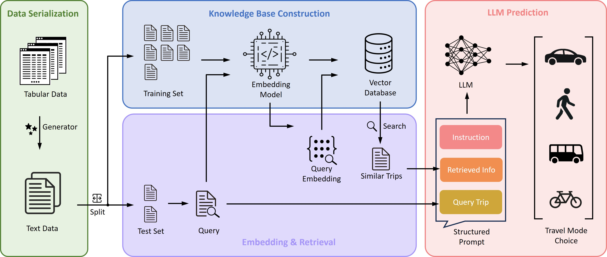

## LLM-Driven Travel Behavior Modeling: RAG for Predicting Trip Dynamics
**May 2025 - Present, The University of Texas at Austin**   

- Developed a modular framework for integrating RAG into LLM-based travel mode choice prediction.
- Evaluate four retrieval strategies on three LLM architectures with different capability. 
- RAG substantially enhances predictive accuracy across a range of models.

---

## LLM-Agent for SUMO Simulation
**Jan 2025 - Present, The University of Texas at Austin**   

- LLM-powered, web-based transportation simulation platform that integrates SUMO with the OpenAI Agents SDK and the Model Context Protocol (MCP).
- Enables natural language interaction, dynamic scenario editing, and AI-assisted decision support.
- Allows users to conversationally specify simulation tasks and control the simulation.



---

## Digital Twin as Catalyst for Sustainable and Smart City
**Aug 2023 - Dec 2024, The University of Texas at Austin**   
*Partially funded by Center for Smart Transportation (CST), a Tier 1 University Transportation Center*   
*Collaborator: DELL, MarkIII, NVIDIA*

- Developed a web-based platform for real-time urban data publication and visualization, including transit, micromobility, traffic conditions and incidents, accessibility, and emergency.
- Created a 3D city model for Austin, TX on the Nvidia Omniverse platform. Visualized the city dynamics in 3D.
- Constructed an urban simulation model incorporating transportation, air pollution, noise, and facilities for Austin, TX.



---

## Omniverse Isaac Sim and SUMO Co-Simulation 
**May 2025 - Sep 2025, The University of Texas at Austin**     



---

## LLM for Emergency Preparedness
**Jan 2024 - Present, The University of Texas at Austin**   
*Funded by City of Austin*   
*Collaborator: Moody College of Communication at The University of Texas at Austin*

- Gathered corpus data through web scraping and inputting official documents.
- Fine-tuned an LLM model (LLaMA) on millions of QA pairs extracted from the City of Austin and government data.
- Developed a chatbot based on the fine-tuned LLM, complemented with a user-friendly web interface.
- Integrated multi-language chat functionality into the chatbot using NVIDIA Riva.

---

## Warehouse Digital Twin for Manufacturing Robot Simulation
**Jun 2024 - Present, The University of Texas at Austin**   
*Collaborator: DELL*



---

## Autonomous Vehicle Accidents Analysis
**Sep 2024 - Present, The University of Texas at Austin**

- Utilized LLMs (GPT-4o) via the OpenAI API to extract key insights from autonomous vehicle (AV) accident reports.
- Conducted spatiotemporal analysis of AV accidents to identify trends and inform management strategies.
- Developed a Random Forest (RF) model to investigate factors contributing to crash severity.
- Published an AV crash dataset to facilitate validation and further research by academics and industry professionals.

---

## Electric Vehicle Safety and Crash Pattern Analysis
**Mar 2024 - June 2025, The University of Texas at Austin**

- Compared the spatiotemporal distribution, crash severity, and contributing factors between EV-involved crashes and other crashes.
- Developed an ordered logistic regression model to assess the impact of environmental, geographical, and human behavioral factors on EV crash severity.
- Applied Association Rule Mining (ARM) to identify patterns of co-occurring contributing factors in EV crashes.

---

## Electric Vehicle Charging Accessibility Analysis
**Feb 2024 - June 2025, The University of Texas at Austin**

- Calculated accessibility measures for public electric vehicle charging stations in Austin, TX, and analyzed disparities.
- Assessed accessibility inequality using the Lorenz Curve, Gini Coefficient, Theil Index, Palma Ratio, and Segplot, and accessibility poverty through needs-gap analyses and FGT scores.
- Investigated egalitarian and sufficitarian philosophies in federal EV infrastructure programs, identifying misalignments in equity-focused policies.

---

## Evolution of E-scooter Sharing in Austin, TX
**Sep 2023 - Dec 2024, The University of Texas at Austin**

- Developed a Random Forest (RF) model to analyze the influence of built environment and demographic variables on shared e-scooter usage in Austin, TX.
- Assessed the non-linear effects of variables on shared e-scooter trip frequency using Partial Dependence Plots (PDP).
- Explored the spatial heterogeneity of e-scooter’s relationship with ridesourcing trips using the model interpretation method, Shapley Additive Explanations (SHAP).

---

## Real-Time Traffic Monitoring Using Transit Buses as Probes
**July 2023 - Dec 2023, University of Florida**

- Identified the distinct operational on/off-boarding events of bus fleets and estimated the average traffic speed for each road segment using GTFS Realtime data.
- Validated the estimated traffic speed using other data sources including Bluetooth and Google Maps data.

---

## Shared Micromobility Demand Forecasting with Deep Learning
**Jan 2021 - Aug 2023, University of Florida**

- Formulated a novel spatiotemporal model using a Convolutional Neural Network (CNN) and interactive learning mechanisms to predict demand trends in shared micromobility services.
- Developed a deep learning framework using Transformer and Graph Convolutional Network (GCN) to forecast travel demand for dockless scooter-sharing systems.
- Applied the proposed models on real-world datasets in Washington, D.C., Austin, TX, and Chicago, IL. The proposed models achieved over 25% improvement in prediction accuracy compared with benchmark models.

---

## Evacuation Behavior Analysis using Large-Scale GPS Data
**Jan 2021 - Aug 2022, University of Florida**

- Developed methods to infer and analyze the evacuation behavior (i.e., evacuation decision, destination, route choice) of residents during wildfire events using large-scale GPS data.
- Explored key factors associated with residents' evacuation decisions and their effects on evacuation compliance rate in Sonoma County, CA during the 2019 Kincade Fire.
- Developed a deep learning model that incorporates Graph Convolutional Network (GCN) and Gated Recurrent Unit (GRU) to forecast spatiotemporal trip generation during wildfire evacuation.

---

## Micromobility as a Solution to Reduce Urban Traffic Congestion
**Mar 2020 - Aug 2021, University of Florida**

- Scraped real-time micromobility services data and developed algorithms to infer micromobility trip origins and destinations based on real-time system status data.
- Analyzed the spatial and temporal usage patterns of shared micromobility services in Washington, D.C.
- Investigated factors associated with shared micromobility usage, providing insights to aid policymakers' decisions.

---

## Interpretable Machine Learning on the Adoption of Ride-Splitting
**Aug 2019 - Feb 2021, University of Florida**

- Modeled ridesourcing users' adoption of ride-splitting services in Chicago using the Random Forest (RF) model.
- Identified key factors associated with model outcomes using Variable Importance.
- Analyzed nonlinear relationships between factors and outcomes using model interpretation methods, including Partial Dependence Plot and Accumulated Local Effects.
- Explored how understanding nonlinear patterns can assist professionals in managing and promoting ride-sharing.

---

## Evaluation for Autonomous Vehicle Safety
**Dec 2017 - Mar 2019, Tongji University**

- Extracted critical driving scenarios from Shanghai naturalistic driving data for autonomous vehicle safety testing.
- Proposed an accelerated testing scheme for autonomous vehicle safety evaluation using the importance sampling technique. Achieved over 30 times acceleration compared with the Monte Carlo method.
- Designed a software-in-the-loop testing platform for autonomous vehicle testing based on the proposed test scheme.

---

## Vehicle Turning Behavior Modeling at Mixed-Flow Intersections
**Aug 2016 - Sep 2018, Tongji University**

- Developed a quasi-two-dimensional model based on potential field theory to predict trajectories of turning vehicles.
- Evaluated the proposed model by reproducing trajectories of left-turn vehicles at a mixed-flow intersection in Shanghai.

---

## Vehicle Cooperation Around Lane-Changing
**Jun 2018 - Aug 2018, University of Massachusetts Lowell**

- Identified lane-changing scenarios and extracted vehicle trajectories in lane-changing scenarios using NGSIM data.
- Explored vehicle cooperation before, during, and after lane-changing. Characterized and categorized cooperative lane-changing based on the behaviors of leading, ego, and following vehicles.
